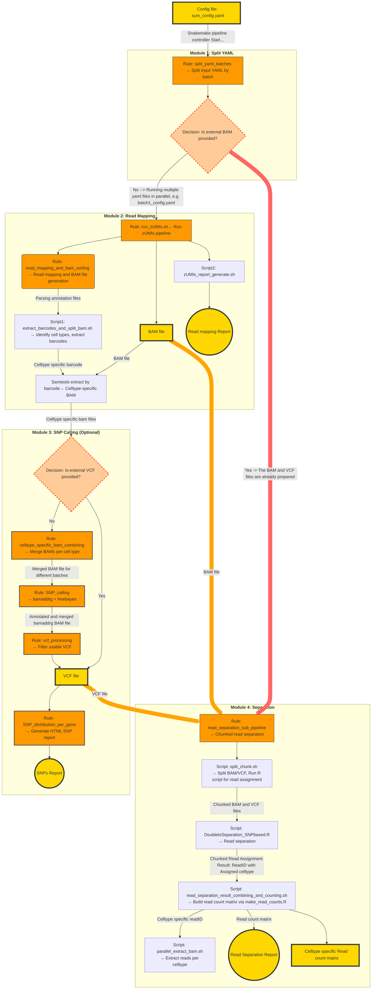

 

```mermaid
 

%% Rules are in rectangles with Black border(Orange)
%% Decision points are in diamonds
%% Scripts in rules are in Squares(Purple)
%% Reports are in circles with Black border(Yellow)

flowchart TD

    %% Config input
    config[Config file: sum_config.yaml]

    config --> |Snakemake pipeline controller Start...| rule_split_yaml

    %% Module 1: Split YAML
    subgraph module1_split_yaml["<b>Module 1: Split YAML <b>"]
        rule_split_yaml[Rule: split_yaml_batches <br>→ Split input YAML by batch]
        check_bam{Decision: Is external BAM provided?}
    end
    


    %% Module 2: Mapping & BAM generation
    subgraph module2_mapping["<b>Module 2: Read Mapping<b>"]
        RUN_ZUMIS[Rule: run_zUMIs.sh→ Run zUMIs pipeline]
        rule_mapping(Rule: read_mapping_and_bam_sorting → Read mapping and BAM file generation)
        extract_barcodes[Script1: extract_barcodes_and_split_bam.sh → Identify cell types, extract barcodes]
        extract_celltype_bam[Samtools extract by barcode→ Celltype-specific BAM]
        zUMIs_HTML_SCRIPT[Script2: zUMIs_report_generate.sh]
        ZUMIS_REPORT((Read mapping Report))
        BAM_FILE[BAM file]

        RUN_ZUMIS --> rule_mapping --> |Parsing annotation files| extract_barcodes --> |Celltype specific barcode| extract_celltype_bam
        RUN_ZUMIS -->  BAM_FILE -->  |BAM file| extract_celltype_bam
        
        RUN_ZUMIS --> zUMIs_HTML_SCRIPT --> ZUMIS_REPORT
        
    end

    rule_split_yaml --> check_bam
    check_bam --> |No --> Running multiple yaml files in parallel, e.g. batch1_config.yaml| RUN_ZUMIS
    check_bam -- "Yes -> The BAM and VCF files are already prepared " --> rule_read_sep

    %% Module 3: SNP Calling (optional)
    subgraph module3_snp["<b>Module 3: SNP Calling (Optional)<b>"]
        check_vcf{Decision: Is external VCF provided?}
        combine_bam[Rule: celltype_specific_bam_combining<br>→ Merge BAMs per cell type]
        snp_calling[Rule: SNP_calling<br>→ bamaddrg + freebayes]
        vcf_processing[Rule: vcf_processing<br>→ Filter usable VCF]
        snp_stats[Rule: SNP_distribution_per_gene<br>→ Generate HTML SNP report]
        snp_stats_report((SNPs Report))
        VCF_FILE[VCF file]

        check_vcf -- "No" --> combine_bam --> |Merged BAM file for different batches|snp_calling --> |Annotated and merged bamaddrg BAM file|vcf_processing --> VCF_FILE
        check_vcf -- "Yes" --> VCF_FILE
        snp_stats --> snp_stats_report
        VCF_FILE --> snp_stats
    end

    extract_celltype_bam --> |Celltype specific bam files|check_vcf

    %% Module 4: Read Separation
    subgraph module4_readsep["<b>Module 4: Separation<b>"]
        rule_read_sep[Rule: read_separation_sub_pipeline<br>→ Chunked read separation]
        split_chunk[Script: split_chunk.sh<br>→ Split BAM/VCF, Run R script for read assignment]
        read_sep_r[Script: DoubletsSeparation_SNPbased.R<br>→ Read separation]
        combine_counts[Script: read_separation_result_combining_and_counting.sh<br>→ Build read count matrix via make_read_counts.R]
        extract_final_bam[Script: parallel_extract_bam.sh<br>→ Extract reads per celltype]
        Read_separation_report((Read Separation Report))
        Matrix[Celltype specific Read count matrix]

        rule_read_sep --> split_chunk --> |Chunked BAM and VCF files|read_sep_r  --> |Chunked Read Assignment Result: ReadID with Assigned celltype|combine_counts --> |Celltype specific readID|extract_final_bam
        combine_counts --> |Read count matrix| Read_separation_report
        combine_counts --> Matrix
    end


    
    VCF_FILE --> |VCF file| rule_read_sep
    BAM_FILE --> |BAM file| rule_read_sep
    
    %% Styles setting
    style check_vcf fill:#fc9,stroke:#f63,stroke-width:4px,stroke-dasharray: 5 5;
    style check_bam fill:#fc9,stroke:#f63,stroke-width:4px,stroke-dasharray: 5 5;
    style rule_split_yaml fill:#f90,stroke:#333,stroke-width:2px;.
    style rule_read_sep fill:#f90,stroke:#333,stroke-width:2px;.
    style rule_mapping fill:#f90,stroke:#333,stroke-width:2px;..
    style RUN_ZUMIS fill:#f90,stroke:#333,stroke-width:2px;.
    style combine_bam fill:#f90,stroke:#333,stroke-width:2px;
    style snp_calling fill:#f90,stroke:#333,stroke-width:2px;
    style snp_stats fill:#f90,stroke:#333,stroke-width:2px;
    style vcf_processing fill:#f90,stroke:#333,stroke-width:2px;
    style ZUMIS_REPORT fill:#FFD700,stroke:#333,stroke-width:4px, width:60px, height:60px;
    style snp_stats_report fill:#FFD700,stroke:#333,stroke-width:4px, width:60px, height:60px;
    style Read_separation_report fill:#FFD700,stroke:#333,stroke-width:4px, width:60px, height:60px;
    style BAM_FILE fill:#FFD700,stroke:#333,stroke-width:4px, width:120px, height:60px;
    style VCF_FILE fill:#FFD700,stroke:#333,stroke-width:4px, width:120px, height:60px;
    style config fill:#FFD700,stroke:#333,stroke-width:4px, width:250px, height:80px;
    style Matrix fill:#FFD700,stroke:#333,stroke-width:4px, width:250px, height:80px;
    linkStyle 10 stroke:#f66,stroke-width:15px
    linkStyle 25 stroke:#FFA500,stroke-width:15px
    linkStyle 26 stroke:#FFA500,stroke-width:15px
    

```